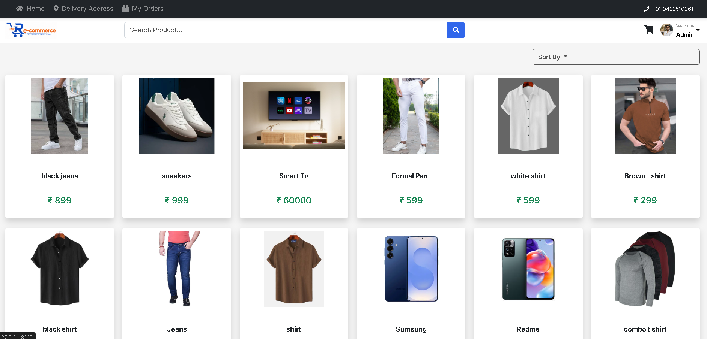
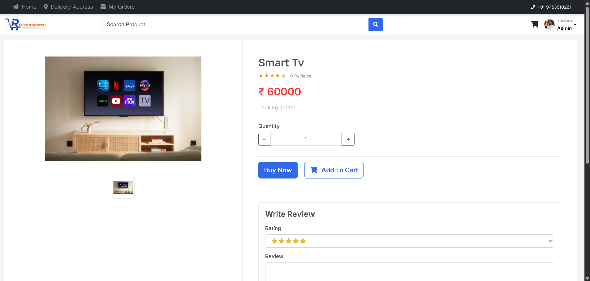
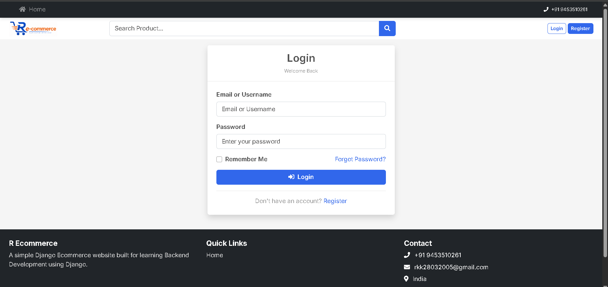
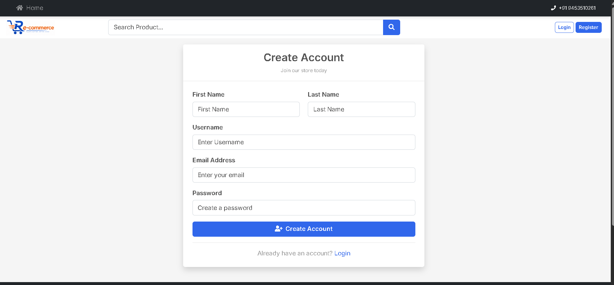
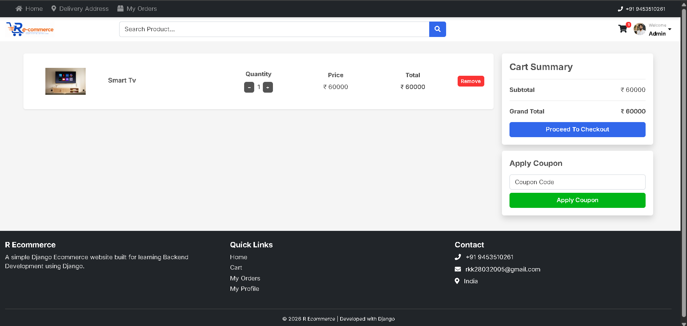
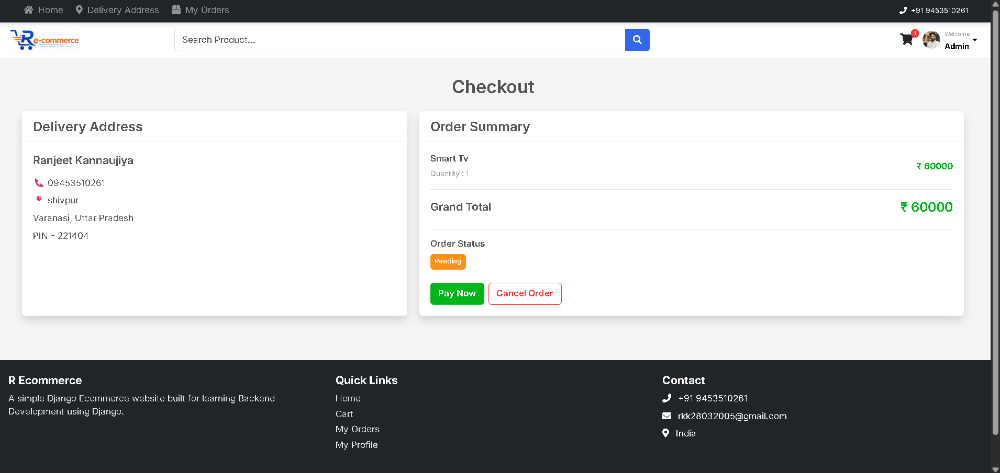
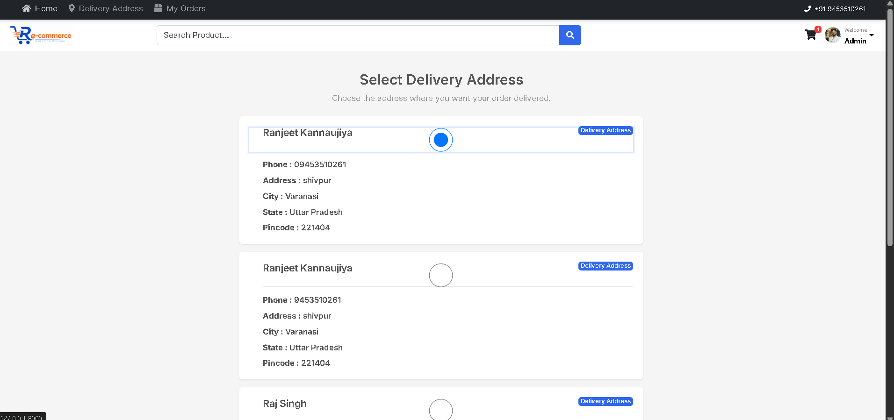
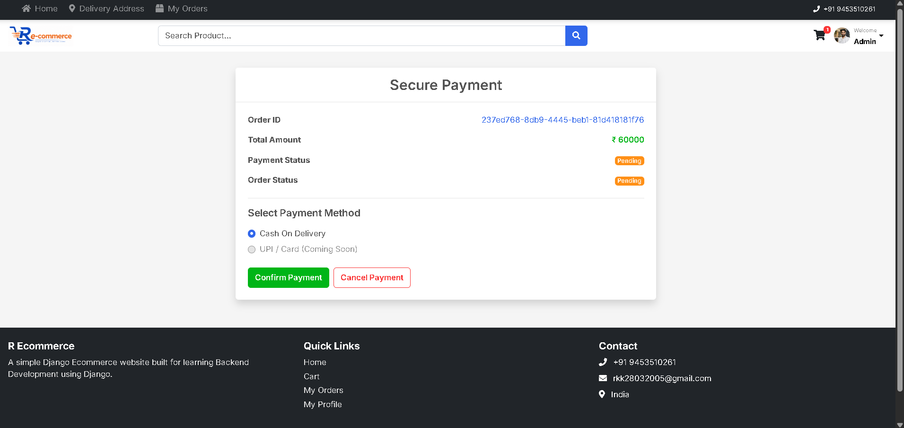
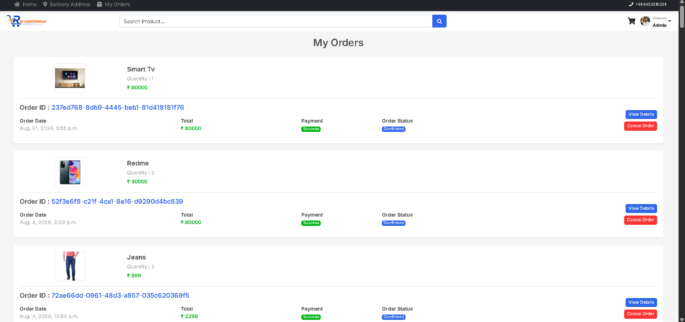
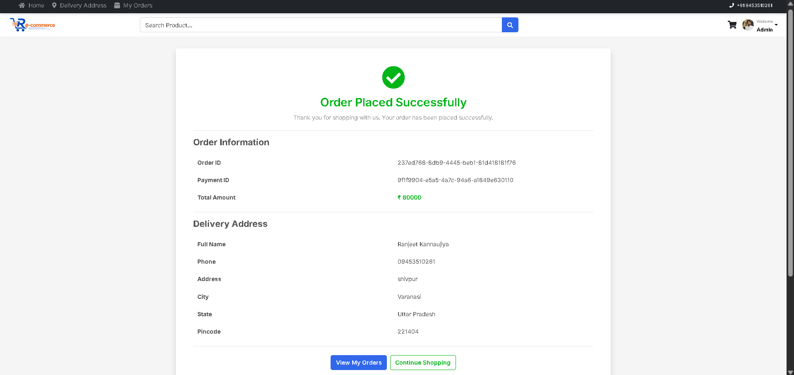

# R Ecommerce

A Django-based ecommerce backend project focused on Python backend development, database modeling, authentication, cart workflows, order processing, and business logic. The project is designed to showcase a real-world e-commerce architecture with modular app boundaries, clean separation of concerns, and production-friendly configuration patterns.

## Project focus

This project is built for backend-first development. The main emphasis is on:

- Django project structure and application organization
- Custom user profile and authentication flow
- Product catalog and variant logic
- Cart and coupon business rules
- Order lifecycle and checkout process
- Email integration and user notifications
- PostgreSQL-based data modeling and relational design
- Clean code organization for scalable web apps

---

## Tech stack

- Python 3.x
- Django
- PostgreSQL
- Django ORM
- HTML, CSS, JavaScript for frontend templates
- SMTP email integration
- Environment variables for configuration

---

## Screenshots

### Home



### Product catalog



### Authentication




### Cart and checkout





### Orders





---

## Project structure

Ecommerce/
├── Ecommerce/
│   ├── __init__.py
│   ├── settings.py
│   ├── urls.py
│   ├── wsgi.py
│   └── asgi.py
├── accounts/
│   ├── models.py
│   ├── views.py
│   ├── urls.py
│   └── migrations/
├── products/
│   ├── models.py
│   ├── views.py
│   ├── forms.py
│   ├── urls.py
│   └── migrations/
├── cart/
│   ├── models.py
│   ├── views.py
│   ├── urls.py
│   └── migrations/
├── order/
│   ├── models.py
│   ├── views.py
│   ├── urls.py
│   └── migrations/
├── home/
│   ├── views.py
│   ├── urls.py
│   └── migrations/
├── base/
│   ├── models.py
│   ├── emails.py
│   └── context_processors.py
├── public/
│   └── static/
├── templates/
├── media/
├── manage.py
├── requirements.txt
├── .env
├── README.md
└── db.sqlite3 (if used locally)
```

---

## Core features

### Authentication and user management

- Django user registration and login
- Extended user profile model via `Profile`
- Email verification token support
- Activation email flow
- Profile picture and phone number support
- User-specific order and cart tracking

### Product catalog

- Category-based product organization
- Product names and slugs for SEO-friendly URLs
- Product images and descriptions
- Price handling with stock support
- Color and size variant support
- Review model with ratings

### Cart and checkout

- Add to cart based on product and variant
- Quantity updates and total calculation
- Coupon discount logic
- Cart items connected to the current user profile
- Order creation based on cart state

### Order system

- Order tracking with status labels
- Payment status and payment ID support
- Address management for shipping
- Per-user order history and order details

### Email system

- SMTP email backend configuration
- Activation mail sending
- Admin and customer notification support
- Environment-based secret and email configuration

---

## Backend architecture notes

This project follows a modular Django backend design:

- `accounts/` handles user profile and authentication-related data
- `products/` contains catalog, category, variants, and reviews
- `cart/` manages cart session logic and discount calculations
- `order/` handles checkout, order state, and address records
- `base/` contains shared utility logic and reusable models
- `Ecommerce/settings.py` centralizes environment-backed config and app setup

This kind of separation makes the code easier to extend when building larger ecommerce systems with APIs, payment gateways, inventory, or admin dashboards.

---

## Environment configuration

Create a `.env` file in the project root with values like:

```env
SECRET_KEY=your_secret_key
DEBUG=True
DB_NAME=ecommerce_db
DB_USER=postgres
DB_PASSWORD=your_password
DB_HOST=localhost
DB_PORT=5432
EMAIL_HOST_USER=your_email@gmail.com
EMAIL_HOST_PASSWORD=your_app_password
EMAIL_FROM_NAME=R Ecommerce
ADMIN_EMAIL=admin@example.com
SITE_URL=http://127.0.0.1:8000
```

> Keep secrets out of the source code. Use environment variables and do not commit your production credentials.

---

## Setup instructions

1. Create and activate a virtual environment.
2. Install dependencies:

```bash
pip install -r requirements.txt
```

3. Configure PostgreSQL and update your `.env` values.
4. Run migrations:

```bash
python manage.py migrate
```

5. Create a superuser:

```bash
python manage.py createsuperuser
```

6. Run the development server:

```bash
python manage.py runserver
```

7. Open the app in the browser:

```text
http://127.0.0.1:8000/
```

---

## Recommended backend improvements

For a more production-ready Python backend, these are strong next steps:

- Add API endpoints using Django REST Framework
- Add JWT or token-based authentication
- Implement payment gateway integration
- Improve inventory and stock validation
- Add order cancellation and refund flow
- Add admin analytics and dashboard reporting
- Add tests for cart, order, and product logic
- Add serializer and service layer separation for cleaner business logic

---

## Notes for developers

This project is a strong example of a Python backend developer workflow in Django:

- relational database modeling
- model validation and business rules
- signal-based automation
- modular app structure
- environment-driven config
- reusable common models and utilities

If you are polishing your backend portfolio, this project demonstrates practical ecommerce patterns and a Django architecture that can be extended into a production-ready platform.

---

## License

This project is intended for educational and portfolio use unless otherwise specified by the owner.
